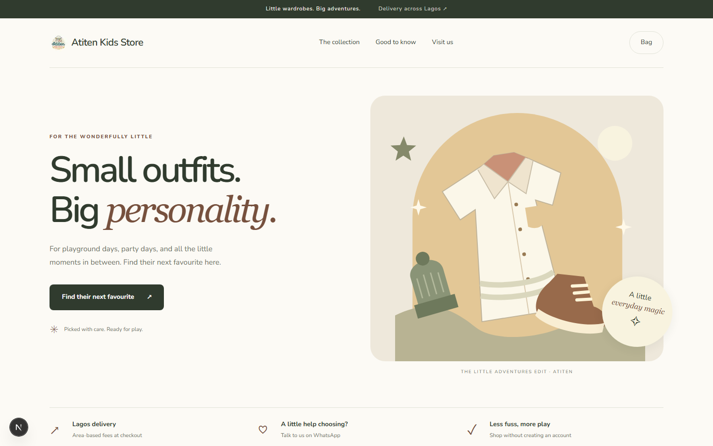

# Atiten Kids Store

A mobile-first storefront and operations dashboard for an independent children's fashion retailer in Lagos.



## Overview

Atiten Kids Store turns a social-media-led retail business into a focused online shopping experience. Customers can browse a branded catalogue, filter products, select colour and size variants, keep a local shopping bag, check out without creating an account, and follow an order through payment and fulfilment.

The same application gives the store team practical tools for managing products, stock, delivery areas, orders, customer communication, refunds, and sales activity. The project is designed for the realities of a small retailer: mobile traffic, WhatsApp-assisted shopping, Lagos delivery zones, limited operational overhead, and provider-verified payments.

## Frontend highlights

- Distinct editorial storefront with a responsive, mobile-first layout
- Search, category, size, price, and availability filters
- Product galleries, colour and size variants, stock-aware purchase controls, and related products
- Persistent local shopping bag and guest checkout
- Delivery-area selection and server-priced order summaries
- Private order-status pages and a deterministic demo-payment flow
- WhatsApp product sharing and customer-support handoff
- Accessible navigation, labelled controls, descriptive imagery, loading states, and reduced-motion support
- Responsive administration screens for catalogue, categories, product photography, orders, delivery settings, and store analytics

## Operations dashboard

The authenticated dashboard gives store operators one place to:

- Create and edit products, variants, prices, publication status, and inventory
- Upload, describe, reorder, and remove product photography through signed Cloudinary uploads
- Review recent orders and move paid orders through fulfilment
- Contact customers through prefilled WhatsApp links
- Cancel eligible orders with exactly-once stock restoration
- Record completion of manual refunds
- Configure delivery areas and storefront settings
- Monitor sales, fulfilment, stock risk, top products, and checkout-source attribution

## Technology

| Layer | Stack |
| --- | --- |
| Storefront and dashboard | Next.js 16, React 19, TypeScript, Tailwind CSS 4, Motion |
| API | FastAPI, Pydantic, SQLAlchemy |
| Data | PostgreSQL, Alembic migrations |
| Media | Cloudinary signed uploads |
| Quality | Vitest, Testing Library, ESLint, pytest, Ruff, mypy, Postman contract checks |
| Delivery | Docker Compose and GitHub Actions-ready workflows |

## Architecture

The public store and administration dashboard live in one Next.js application. Business rules and persistence are isolated in a FastAPI modular monolith, with PostgreSQL as the system of record.

```text
bukkystore/
  apps/
    web/                 Next.js storefront and admin dashboard
    api/                 FastAPI application and migrations
  docs/
    architecture/        Domain, commerce-flow, and API blueprints
    adr/                 Architecture decision records
  postman/               Versioned API contract collection
```

Prices, stock reservations, payment state, and fulfilment transitions are calculated or verified by the API. The browser never supplies an authoritative amount or payment result. Analytics are deliberately non-blocking so tracking failures cannot stop checkout.

Further design notes:

- [Domain model](docs/architecture/domain-model.md)
- [Commerce flows](docs/architecture/commerce-flows.md)
- [API contract](docs/architecture/api-contract.md)
- [Delivery roadmap](docs/roadmap.md)

## Local development

### Prerequisites

- Node.js 22+
- Python 3.12+
- `uv`
- Docker
- PostgreSQL, supplied through Docker Compose

### 1. Configure the project

```powershell
Copy-Item .env.example .env
```

Replace the placeholder secrets in `.env`. Cloudinary values are optional unless testing the product-photo workflow.

### 2. Start PostgreSQL

```powershell
docker compose up -d postgres
```

### 3. Prepare and run the API

```powershell
uv sync --project apps/api
uv run --project apps/api alembic -c apps/api/alembic.ini upgrade head
uv run --project apps/api python -m bukkystore_api.seed
uv run --project apps/api python -m bukkystore_api.auth.bootstrap --email owner@example.com --display-name "Store Owner" --role OWNER
uv run --project apps/api uvicorn --factory bukkystore_api.main:create_app --app-dir apps/api/src --reload
```

The bootstrap command requests a password without echoing it. The first administrator must be an `OWNER`; there is no public administration signup.

### 4. Run the web application

```powershell
npm install
npm run web:dev
```

Open the following local URLs:

- Storefront: `http://localhost:3000`
- Administration: `http://localhost:3000/admin/login`
- API documentation: `http://localhost:8000/api/docs`
- API liveness: `http://localhost:8000/api/v1/health/live`

## Quality checks

```powershell
uv run --project apps/api ruff check apps/api
uv run --project apps/api ruff format --check apps/api
uv run --project apps/api mypy apps/api/src
uv run --project apps/api pytest apps/api

npm run web:lint
npm run web:test
npm run web:build
```

For the versioned API contract, copy the example Postman environment to its ignored local filename, start the API, and run:

```powershell
postman collection run ./postman/bukkystore.postman_collection.json -e ./postman/bukkystore.postman_environment.json --reporters "cli,junit"
```

## Current product boundaries

- Checkout is guest-first; creating a customer account is intentionally out of scope.
- Lagos delivery uses administrator-managed areas and flat fees.
- Adding an item to the bag does not reserve stock; beginning checkout does.
- The fake payment provider exercises the production-shaped transaction flow during development. OPay remains behind a provider boundary until merchant onboarding and authenticated callback access are available.
- Seeded products and delivery fees are development data and must be confirmed with the store owner before production use.
- Product photographs are not seeded. Cloudinary credentials are required for the administration uploader.

## Background reconciliation

Run reservation expiry periodically so abandoned checkouts release stock:

```powershell
uv run --project apps/api python -m bukkystore_api.commerce.reconcile
```
