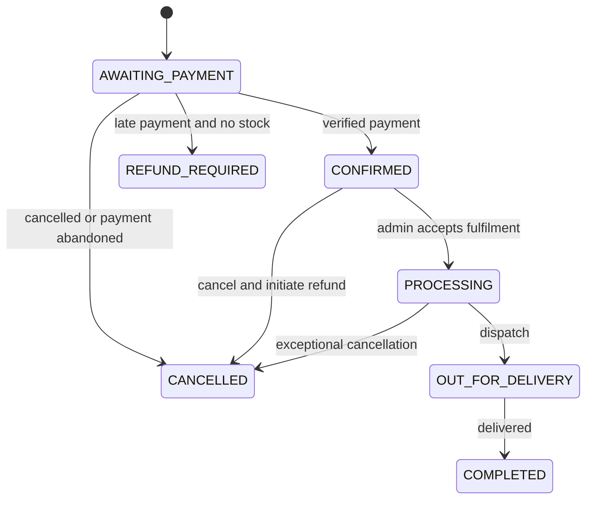

# Commerce Flows

## Cart versus checkout

The cart is client-side convenience state and does not affect inventory. It sends
only variant IDs and quantities. The API ignores any client-supplied name, price,
stock status, delivery fee, subtotal, or total.

Checkout is the point at which stock is temporarily reserved. The default
reservation lifetime is configuration, initially proposed as 15 minutes.

## Checkout orchestration

`POST /api/v1/checkout` requires an idempotency key and performs:

1. Strictly validate customer details, delivery-area ID, item IDs, and quantities.
2. Begin a short database transaction.
3. Lock the selected active variants in deterministic ID order.
4. Load products and delivery area with explicit eager loading.
5. Confirm each requested quantity is available.
6. Calculate prices, subtotal, delivery fee, and total on the server.
7. Create the order and immutable order items.
8. Create the reservation and atomically increment reserved counters.
9. Create an `INITIALIZING` payment attempt with a unique business reference.
10. Commit before making any external network call.
11. Ask the configured payment provider to initialize hosted payment.
12. Persist the provider reference and URL, moving the attempt to `PENDING`.

The external provider call is deliberately outside the database transaction. A
slow provider must not hold inventory row locks. If initialization fails, the
attempt becomes `FAILED`, the reservation is released transactionally, and the
API returns a safe error with a correlation ID. Retrying the same idempotency key
returns or resumes the same logical checkout rather than creating another order.

## Payment confirmation

A browser redirect never confirms payment. Only a verified webhook or an
authenticated server-to-server status query can do so.

For a success notification, the handler:

1. Enforces request-size and timestamp boundaries.
2. Authenticates the provider notification using the provider-specific mechanism.
3. Deduplicates the event before applying effects.
4. Locks payment, order, reservation, and variants in one transaction.
5. Confirms provider reference, amount, currency, and terminal status.
6. Converts an active reservation: decrement `stock_on_hand` and
   `reserved_quantity`, append `SALE` movements, mark the reservation converted,
   payment successful, and order confirmed.
7. Commits and acknowledges the provider in its required response format.

Repeated success notifications return success without repeating stock changes.
Out-of-order failure notifications cannot downgrade an already successful payment.

## Reservation expiry and late payment

A scheduled reconciliation job expires overdue reservations in batches, using row
locks with skip-locked semantics. It releases reserved counters and records the
expiry without changing stock on hand.

If a verified success arrives after expiry:

- When stock is still available, lock it and complete the sale atomically.
- When stock is no longer available, record the successful payment, place the
  order in `REFUND_REQUIRED`, do not create negative stock, and surface an urgent
  admin alert.

This exception cannot be silently treated as a failed payment because the customer
has already been charged.

## Payment reconciliation

Webhook delivery may fail. A periodic job queries the provider for payment attempts
that remain pending beyond a configured threshold. It feeds verified results into
the same idempotent confirmation service used by webhooks.

The application is developed against a deterministic fake provider until real
merchant access exists. OPay-specific authentication, amounts, endpoints, and
callback responses are confined to the OPay adapter and verified against the
merchant's assigned documentation before launch.

## Cancellation and refunds

### Before successful payment

- Cancel the order.
- Release an active reservation.
- Never change stock on hand.

### Paid but not dispatched

- An authorized admin records the cancellation reason.
- The allocated item quantity is restored exactly once with
  `CANCELLATION_RESTOCK` movements.
- A refund record is created separately.
- The initial release may record a manual refund; provider-API refunds can be
  introduced after the selected provider is confirmed.

### Processing or later

- During processing, cancellation requires an explicit admin decision.
- Once out for delivery, ordinary cancellation is unavailable. Returns are a
  separate later workflow.
- Delivery fees are refundable only when delivery has not begun, subject to the
  store's published policy.

Refund failure does not reopen or duplicate stock mutations. It remains visible as
a finance exception for an admin to resolve.

## Order transitions

Transitions are enforced in the domain service rather than accepted as arbitrary
status strings from an admin request.

## Failure isolation

- Analytics failure is logged and never rolls back commerce.
- Notification failure is retried or shown to admins and never changes payment
  truth.
- Provider timeouts remain unknown/pending until queried; they are not guessed to
  be failed.
- Exceptions become safe API errors with correlation IDs. Stack traces, SQL
  messages, secrets, and raw provider failures never reach clients.
