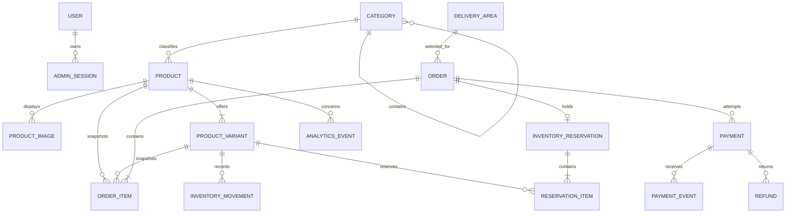

# Domain Model

## Principles

1. PostgreSQL is authoritative for price, sellable stock, orders, and payment
   state.
2. Money is stored as integer minor units and carries an explicit currency.
3. Products and categories are archived instead of hard-deleted once referenced.
4. Orders snapshot names, variants, prices, delivery details, and customer details
   so later catalogue changes do not rewrite history.
5. Stock is owned by a product variant, including a generated default variant for
   products without customer-selectable options.
6. State changes are explicit, transactional, idempotent, and auditable.
7. UTC is used in persistence. The UI localizes timestamps for the store.

## Entity relationship overview



## Identity and administration

### `users`

| Field | Rule |
| --- | --- |
| `id` | UUID primary key |
| `email` | Normalized, unique |
| `password_hash` | Strong password hash; never returned |
| `display_name` | Required |
| `role` | `OWNER` or `ADMIN` initially |
| `is_active` | Disabled users cannot authenticate |
| timestamps | UTC created/updated/last-login times |

The aunt starts as `OWNER`; the second manager starts as `ADMIN`. Only the owner
may change administrators, store ownership, or payment configuration.

### `admin_sessions`

Stores hashed refresh/session tokens, expiry, revocation time, and minimal device
metadata. Browser credentials are transported only through secure, HTTP-only,
same-site cookies. Raw tokens are never persisted.

## Catalogue

### `categories`

- UUID primary key, unique slug, name, optional `parent_id`, display position,
  `is_active`, and timestamps.
- Parentage supports a shallow hierarchy such as Clothing > Dresses without
  hardcoding category names.
- Cycles and self-parenting are rejected.

### `products`

- UUID, category, unique slug, name, description, base price in minor units,
  optional compare-at price, publication status, featured flag, and timestamps.
- Publication status is `DRAFT`, `ACTIVE`, or `ARCHIVED`.
- A product is sold out when every active variant has zero available quantity.
- Compare-at price, when present, must be greater than the selling price.

### `product_images`

- Product foreign key, Cloudinary public identifier, secure URL, alt text,
  dimensions, display position, and timestamps.
- The public identifier is retained so an image can be transformed or deleted
  safely through Cloudinary.

### `product_variants`

| Field | Rule |
| --- | --- |
| `id` | UUID primary key |
| `product_id` | Required foreign key |
| `sku` | Unique, human-manageable identifier |
| `colour` | Nullable normalized label |
| `size` | Nullable normalized label |
| `display_name` | Generated customer-facing label |
| `price_override_minor` | Nullable; base product price is the fallback |
| `stock_on_hand` | Non-negative integer |
| `reserved_quantity` | Non-negative and never above stock on hand |
| `low_stock_threshold` | Non-negative integer, default 2 |
| `status` | `ACTIVE` or `ARCHIVED` |

The pair of normalized colour and size is unique within a product. PostgreSQL's
default treatment of nulls must not permit duplicate colour-only, size-only, or
default combinations; the migration uses a nulls-not-distinct unique constraint
or equivalent normalized index. A product with no options receives one variant
with both fields null and a display name such as `Default`. Shoe sizes use the
same size field; bags may use colour only.

Available quantity is:

```text
stock_on_hand - reserved_quantity
```

### `inventory_movements`

An append-only audit ledger containing variant, signed quantity change, movement
type, order or reservation reference, actor, reason, idempotency key, and UTC
timestamp. Movement types initially include:

- `INITIAL_STOCK`
- `ADMIN_ADJUSTMENT`
- `SALE`
- `CANCELLATION_RESTOCK`
- `RETURN_RESTOCK`

The current variant counters make reads fast; the movement ledger explains every
permanent stock change.

## Delivery

### `delivery_areas`

- UUID, unique normalized name, fee in minor units, display position, `is_active`,
  and timestamps.
- Examples such as Ikeja or Yaba are data, not source code.
- Checkout accepts only an active area. Customers outside the configured list are
  directed to WhatsApp rather than charged a guessed fee.
- The selected area name and fee are copied onto the order.

No distance calculation, map integration, or zone hierarchy is required for the
first release.

## Orders and reservations

### `orders`

Stores a UUID, unique public order number, customer contact and delivery snapshot,
monetary totals, currency, attribution, status, optional cancellation reason, and
timestamps.

Customer phone number, full name, address, and delivery area are required. Email
and additional directions are optional. Access to customer data is admin-only and
logs must mask it.

Order status:

```text
AWAITING_PAYMENT
CONFIRMED
PROCESSING
OUT_FOR_DELIVERY
COMPLETED
CANCELLED
REFUND_REQUIRED
```

`REFUND_REQUIRED` is an operational exception, not proof that money was refunded.

### `order_items`

Stores product and variant references plus immutable snapshots of product name,
variant description, SKU, unit price, quantity, and line subtotal. Quantities must
be positive and totals must equal the server-calculated values.

### `inventory_reservations`

One checkout reservation per order, with status `ACTIVE`, `CONVERTED`, `RELEASED`,
or `EXPIRED`, an expiry timestamp, and conversion/release timestamps.

### `reservation_items`

Stores the variant and reserved quantity for each order item. Reservation rows and
variant `reserved_quantity` counters are always changed in the same transaction.

## Payments and refunds

### `payments`

An order may have multiple payment attempts. Each stores provider, unique internal
reference, optional provider reference, expected amount/currency, status,
provider-safe error code, checkout expiry, and timestamps.

Payment status:

```text
INITIALIZING
PENDING
SUCCESS
FAILED
PARTIALLY_REFUNDED
REFUNDED
```

Provider responses are parsed into strict schemas. Only a minimal redacted payload
needed for reconciliation may be retained; raw secrets, full account details, and
unbounded provider bodies are not stored.

### `payment_events`

Append-only webhook receipts containing provider, a provider event identifier or
stable payload hash, payment reference, sanitized status data, processing result,
and timestamps. A uniqueness constraint prevents duplicate notification handling.

### `refunds`

Stores payment, amount, reason, mode (`MANUAL` or `PROVIDER_API`), provider
reference, status, actor, and timestamps. Refund status is `PENDING`, `SUCCESS`,
or `FAILED`. A cancelled order and a successful refund are separate facts.

## Settings and analytics

### `store_settings`

A singleton record holds the provisional name `Bukky Store`, logo reference,
WhatsApp/phone details, social links, currency, city, minimum order, and business
hours. Business configuration is not hardcoded.

### `analytics_events`

Stores a constrained event type, anonymous session identifier, optional product,
source, campaign, bounded metadata, and UTC timestamp. Event ingestion is
best-effort, rate-limited, and isolated from purchasing transactions.

## Database invariants

- All quantities and money values are non-negative unless a signed movement
  explicitly represents a delta.
- `reserved_quantity <= stock_on_hand` for every variant.
- An order, payment, refund, or inventory side effect has a unique idempotency key.
- A successful payment amount and currency exactly match the order total before
  the order is confirmed.
- Stock conversion happens at most once for an order.
- Archived catalogue records remain readable by historical orders.
- Foreign-key loading is explicit; list endpoints use `selectinload` or joined
  projections to prevent N+1 queries.
